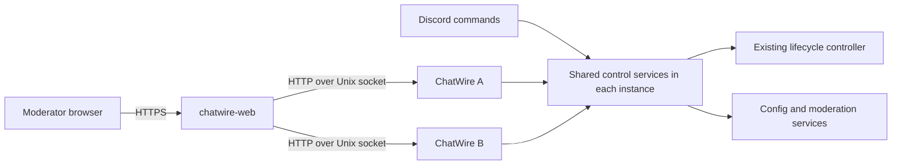

# Web control server and API proposal

Status: design proposal, 2026-09-20. One dashboard for all local ChatWire instances
is the agreed topology. Login uses a private link issued by a Discord command,
as requested. Expiry values and other implementation choices are proposed defaults.
This document records the proposed architecture. The implementation and its
current application/recovery semantics are documented in
[web-control-setup.md](web-control-setup.md); the public contract is in
[web-control-openapi.json](web-control-openapi.json). Enabling listeners requires
explicit instance/service configuration. Source changes do not restart services.

## Architecture

Run a separate `chatwire-web` Go executable on the host. It serves the dashboard,
authenticates moderators, and routes requests to the existing ChatWire processes.
Each ChatWire process owns its Factorio instance and exposes a small private HTTP
API over a Unix domain socket. The web executable does not import and initialize
the current process-wide `cfg`, `fact`, and `glob` runtime for multiple servers.



The dashboard survives individual ChatWire reboots. If the web process stops,
Discord commands and Factorio management continue. If an instance is unavailable,
show it as offline with a last-seen timestamp; do not interpret that as Factorio
being stopped. Starting Factorio requires a reachable ChatWire instance. Recovering
a stopped ChatWire service remains the host service manager's responsibility in
v1; a future supervisor adapter could expose explicitly configured service units.

Use an explicit host registry, provisionally `cw-web-config.json`, with stable
instance IDs, labels, enabled flags, and absolute socket paths. Keep callsigns as
display/configuration values rather than identity. Verify the ID returned by each
socket. Do not accept socket paths, arbitrary URLs, or filesystem paths from a
browser request. A single host/shared-config group is the initial scope.

Illustrative registry (paths and port are examples, not deployment settings):

```json
{
  "listen": "127.0.0.1:8787",
  "public_origin": "https://chatwire.example.org",
  "instances": [
    {"id": "server-a", "label": "A", "enabled": true, "socket": "/run/chatwire/a/control.sock"},
    {"id": "server-b", "label": "B", "enabled": true, "socket": "/run/chatwire/b/control.sock"}
  ]
}
```

Use a dedicated socket directory with controlled ownership and restrictive
permissions, plus a per-instance credential shared only with the web service.
Private requests include authenticated actor/capability context supplied by the
web service; public clients cannot override it. Each instance validates that
credential, target identity, protocol version, capability, and action parameters.
The web service is a trusted administrative component.

## Fit with the current code

| Existing code | Design consequence |
|---|---|
| `fact/lifecycle.go`: `SubmitLifecycleRequest`, `GetLifecycleState`, `RequestID`, `WhenEmpty` | Reuse the lifecycle controller for start, stop, restart, map change/reset, and ChatWire reboot. Add correlated completion events. |
| `fact/operation_status.go` | Current operation tracking is transient and primarily presentation-oriented. It is not a durable job API; introduce structured operation events before adapting this presentation layer. |
| `commands/moderator/*.go` | Extract validation and execution into shared services. Discord and HTTP become adapters; do not fabricate Discord interactions for HTTP. |
| `commands/moderator/settings.go`, `cfg/struct.go` | Reuse existing constraints, then classify every config field explicitly. Pointer-based setting lists and `form`/`web` tags are not an API or authorization policy. |
| `cfg/localCfg.go`, `cfg/globalCfg.go` | Atomic file replacement already exists. Add synchronized snapshots and transactions to avoid lost updates and concurrent access to mutable globals. |
| `support/config_reload.go`, moderator `ReloadConfig` | Consolidate reload paths and return structured validation/application errors. |
| `commands/util.go`, `glob.UpdatersLock`, `util/filelock.go` | Discord's command mutex alone cannot serialize HTTP, background tasks, or multiple processes. Coordinate at the resource owner, with cross-process locks for shared resources. |
| `commands/commands_admin.go`, `commands/commands_moderator.go` | Preserve moderator/admin distinctions and primary-only ownership for shared operations. |

## Authentication and permissions

Use a `/web` moderator command that returns a private, single-use login link.
There are no new moderator passwords or OAuth setup. Discord already identifies
the command's author and supplies the guild-member roles. The command uses an
ephemeral response, which [Discord documents as visible only to the invoking
user](https://github.com/discord/discord-api-docs/blob/main/developers/interactions/receiving-and-responding.mdx).

1. The primary ChatWire instance handles `/web` so shared bot credentials do not
   produce competing responses. Check application ID, guild, and moderator/admin
   role IDs with the same policy as existing commands. Defer ephemerally while
   contacting the web service if needed.
2. Over a private web-service Unix socket, call
   `POST /internal/v1/login-grants` with the verified Discord user ID, guild ID,
   role IDs, and interaction ID. Authenticate the caller with a credential scoped
   to grant issuance and role checks; the public router cannot issue grants.
   Derive capabilities centrally rather than accepting a caller-supplied admin flag.
3. The web service generates 32 cryptographically random bytes, stores only a
   token digest with the principal, scope, expiry, and unused state, and returns
   `https://chatwire.example.org/login#token=...`. Default validity: two minutes.
   A new grant invalidates that user's previous unused grant. Rate-limit issuance
   and deduplicate interaction IDs. Only include the configured public origin.
4. Discord presents an ephemeral **Open ChatWire** link with its expiry and a
   short instruction not to share it. Suppress embeds. Never log the link/token,
   send it to a public channel, or put it in an audit entry.
5. The landing page reads the URL fragment into memory and immediately removes
   it using `history.replaceState`. It has no third-party scripts/resources,
   uses `Referrer-Policy: no-referrer`, and does not store the token in browser
   storage. A **Continue to dashboard** button performs a same-origin
   `POST /auth/exchange` with the token; GET never consumes it. This avoids normal
   link previews redeeming the grant and makes login an intentional browser action.
6. Exchange validates origin, grant, expiry, current authorization, and a
   short-lived landing-page CSRF nonce. Atomically consume the grant and create
   an opaque server-side session; concurrent redemption has exactly one winner.
   Set a fresh `Secure`, `HttpOnly`, `SameSite=Lax` cookie and return a fixed
   dashboard destination. An invalid, used, or expired link asks the moderator to
   run `/web` again. Never silently switch an already signed-in account.

The link is a temporary bearer credential: anyone who obtains an unused link
can redeem it as its issuing user. Ephemeral delivery, short expiry, one-time
redemption, and avoiding URL/body logging limit that exposure; they do not prove
the browser belongs to the Discord user. Do not bind links to IP addresses,
since Discord and the browser may use different networks/devices.

Proposed session defaults: 30 minutes idle and eight hours absolute lifetime;
passive SSE traffic does not extend idle expiry. Store session-token digests and
principal metadata server-side. In v1, web-service restart invalidates sessions
and unused login grants. Require same-origin mutations and a session CSRF token;
logout is POST. `/web action:logout-all` revokes all sessions and unused grants
for the invoking user through the private broker. Admins can also revoke a
specific user's sessions through `POST /auth/revocations`.

Recheck guild membership and roles through the primary instance's existing bot
REST access, using role snapshots no older than 60 seconds. The instance provides
`GET /internal/v1/members/{user}/authorization` to the authenticated web service.
Refresh before admitting any authenticated request with an expired role snapshot,
and periodically for open event streams. Fail closed when refresh is unavailable;
invalidate access when membership/roles are removed. No new bot token goes to
the browser. Record login, exchange, logout, and revocation by Discord user ID.
New logins require Discord and the primary instance; the dashboard itself remains
a separate process. `-noDiscord` and `-localTest` never bypass web authentication.

| Role | Default access |
|---|---|
| Moderator | Read registered servers; change moderator settings; execute current moderator actions, including RCON, player levels, and IP bans. |
| Admin | Moderator access plus shared configuration, credentials, paths, identity/role configuration, and host registry management. |

Internally use capabilities such as `server.read`, `server.configure`,
`server.lifecycle`, `server.rcon`, `players.manage`, `host.firewall`, and
`global.configure`. Return allowed capabilities to the UI and enforce them on
every request, including downloads and streams. Initial role mappings preserve
existing command access; a server-ID allowlist can narrow a principal's access.

Never serialize raw config structs to the browser. Secret fields return only
`configured: true/false`; replacement is write-only and clearing is an explicit
operation. Do not return bot/Factorio tokens, RCON passwords, socket credentials,
or session credentials in API payloads, validation errors, logs, or audit diffs.
The login grant is returned only to its trusted issuer for ephemeral delivery;
the browser session is returned only in the protected cookie.

## Public HTTP contract

Base path: `/api/v1`. Serve the dashboard from the same origin. Use JSON with
explicit DTOs, UTC RFC 3339 timestamps, opaque string IDs, bounded cursor-based
list pagination, strict request decoding, and structured field errors. Private
socket endpoints are separately versioned under `/internal/v1` and unavailable
through the public router.

Below, `{s}` is a stable registered server ID. Every route requires authentication
except the login landing/exchange flow and a minimal liveness response without
host details. The exchange requires a valid login grant and landing-page nonce.

| Method and path | Purpose |
|---|---|
| `GET /me` | Identity, capabilities, permitted server IDs, CSRF token |
| `GET /servers` | Status summary, availability, last-seen time, active job per instance |
| `GET /servers/{s}` | Consistent runtime snapshot: lifecycle, players, map, version, updates, pending actions |
| `GET /servers/{s}/settings/schema` | Fields, types, limits, choices, access, scope, and application effects |
| `GET /servers/{s}/settings` | Redacted settings snapshot with revision/ETag |
| `PATCH /servers/{s}/settings` | Validate and persist a settings transaction using `If-Match` |
| `GET /servers/{s}/actions` | Supported action names, input schemas, current prerequisites and impact |
| `POST /servers/{s}/actions/{action}` | Submit a typed action; return a job |
| `GET /servers/{s}/players` | Current player list and non-sensitive details |
| `GET /servers/{s}/saves` | Save IDs and metadata |
| `GET /servers/{s}/saves/{save}/download` | Authorized streamed download |
| `GET /servers/{s}/map-generators` | Available presets, generators, and scenarios |
| `GET /servers/{s}/mods`, `GET /servers/{s}/mods/history` | Mod inventory, preferences, updater exclusions, bounded history |
| `POST /servers/{s}/uploads` | Stage and validate multipart save/mod-list/mod-settings files; no activation |
| `DELETE /servers/{s}/uploads/{upload}` | Remove an unused staged upload |
| `GET /servers/{s}/logs` | Bounded log page by stream and cursor; no arbitrary path input |
| `GET /settings/global/schema`, `GET /settings/global` | Shared settings metadata and redacted snapshot |
| `PATCH /settings/global` | Admin-only shared config transaction and propagation job |
| `GET /players`, `GET /players/{player}` | Shared player database search/detail with sensitive-field filtering |
| `POST /players/{player}/actions/set-level` | Shared player-level/ban/delete operation through the primary instance |
| `GET /host/ip-bans`, `POST /host/actions/ip-ban`, `POST /host/actions/ip-unban` | Host-wide UFW operations through the primary instance |
| `GET /host/settings`, `PATCH /host/settings` | Admin-only registry and web-service settings; secrets redacted |
| `POST /batches` | Explicit server targets and allowlisted action, initially RCON-all; parent job with child results |
| `GET /jobs`, `GET /jobs/{job}` | Accepted, active, and completed jobs visible to the principal |
| `GET /events` | Server-sent status/job/config events with bounded replay |
| `GET /audit` | Authorized audit search with pagination |

Browser auth routes are `GET /login`, `POST /auth/exchange`, `POST /auth/logout`,
and admin-only `POST /auth/revocations`, outside `/api/v1`. Ordinary API handlers
accept the session cookie, never the login-link token.

Reads return `200`; staging returns `201`; asynchronous work returns `202` and a
`Location` job URL. Use `400` for malformed input, `401` for missing authentication,
`403` for denied capability, `404` for unknown/invisible resources, `409` for busy
or incompatible state, `412` for stale revisions, `413` for oversized uploads,
`422` for field validation, `428` for a required missing precondition, `429` for
rate limits, and `503` for an unavailable instance or shared owner. Unexpected
errors return `500` with a request ID rather than internal paths or secrets.

```json
{
  "error": {
    "code": "server_busy",
    "message": "A map change is already running.",
    "request_id": "req_123",
    "job_id": "job_456"
  }
}
```

## Command parity and action semantics

Action names are a fixed registry with typed inputs, not a shell-command endpoint.
Each action records its permission, scope, resource locks, prerequisites, expected
effects, and completion condition. Dedicated status/settings resources supplement
the following full moderator/admin command mapping.

| Discord command | Web equivalent |
|---|---|
| `/web` (new) | Issue a private login link; optional `action:logout-all` revokes the invoking user's access |
| `/factorio start` | `factorio-start`; explicit `factorio-restart` is separate |
| `/factorio stop` | `factorio-stop`, including disabling autolaunch |
| `/factorio new-map` | `map-create` |
| `/factorio update-mods`, `sync-mods` | `mods-update`, `mods-sync` |
| `/factorio archive-map` | `map-archive`, returning archive/download metadata |
| `/factorio update-factorio`, `install-factorio` | `factorio-update`, `factorio-install` |
| `/chatwire reboot`, `queue-reboot`, `force-reboot` | `chatwire-restart` with explicit `when_empty`/`force` options |
| `/chatwire queue-fact-reboot` | `factorio-restart` with `when_empty: true` |
| `/chatwire reload-config` | `config-reload` |
| `/map-reset`, `/change-map` | `map-reset`, `map-load` with a save ID; saves list for selection |
| `/map-generator`, `/map-exchange` | Generator setting and `map-exchange` action |
| `/map-schedule`, `/config-hours` | Typed schedule and play-hours settings |
| `/config-server`, `/config-global` | Local and global settings resources |
| `/upload` | Stage files, then `upload-apply` with upload IDs and an explicit activation plan |
| `/editmods` | `mods-edit` (add/remove/enable/disable/version preference); `mods-clear`; history reads; `mods-clear-history` also clears updater blacklist |
| `/rcon`, `/rconall` | `rcon` action and explicit batch targets |
| `/player-level` | Shared `set-level` action, including ban reason and current level choices |
| `/ip-ban` | Host-wide ban list and ban/unban actions |

Preserve existing execution prerequisites and side effects during extraction.
For example, map-exchange currently requires Factorio stopped and immediately
generates a save; choosing a map generator affects future maps. The current slash
`start` restarts a running server: preserve that behavior in its Discord adapter,
but make HTTP `factorio-start` a no-op success when already running. Both interfaces
use the same underlying start/restart services. Flag that distinction in UI copy.

Destructive or disruptive actions show a preview with exact target instances,
player counts, save/mod changes, and stop/restart effects. The submission includes
a short-lived confirmation token bound to actor, targets, normalized payload, and
relevant state revision. Revalidate prerequisites when execution begins. Force
reboot and clearing mods require distinct confirmation. Raw RCON remains a
powerful moderator capability; its arbitrary game commands cannot all be given
typed previews or safe retry semantics.

## Jobs, concurrency, and recovery

```http
POST /api/v1/servers/server-a/actions/factorio-restart
Idempotency-Key: 7d761f2e-79cc-43c7-9eec-6a5a8671ae13
Content-Type: application/json

{"when_empty":true,"reason":"Scheduled maintenance","confirmation_token":"confirm_123"}
```

```json
{
  "id": "job_456",
  "server_id": "server-a",
  "action": "factorio-restart",
  "state": "waiting_for_empty",
  "phase": "waiting",
  "created_at": "2026-09-20T18:00:00Z"
}
```

Provide `POST /servers/{s}/actions/{action}/preview` for confirmation-bound actions
and an equivalent preview for destructive shared/host/batch actions. Preview does
not reserve resources or execute work.

Job states: `queued`, `waiting_for_empty`, `running`, `succeeded`, `failed`,
`interrupted`, and `unknown`. Include actor/source, request ID, timestamps, phase,
structured result/error, and child jobs where relevant. Show phase progress;
only show a percentage when it is measurable. No generic cancellation in v1.

Require idempotency keys for action submissions. Bind keys to principal, target,
action and payload hash; identical repeats return the same job, mismatched reuse
returns `409`. Keep key records for at least 24 hours and for the full lifetime
of unfinished jobs. Expired keys are not a license for transparent client retry.

The web service persists dispatch intent and aggregate jobs. The executing
instance durably records acceptance before side effects, and checkpoints relevant
phases and completion. Use per-job atomic records and an append-only audit stream
initially; no external database service is required. Persist a logical operation
ID through `fact.Request.RequestID` and emit completion/progress from the actual
controller. Discord and automatic actions must also appear in operation status.

After transport failure, reconcile by operation ID rather than submitting again.
On process restart, inspect durable checkpoints and actual runtime state. A
ChatWire reboot is successful only after a new boot ID reconnects and confirms
the expected result. Mark unverifiable side effects `unknown`; never replay
RCON, resets, installs, or file activation just because a response was lost.
Browser disconnects do not cancel accepted work. Web shutdown stops accepting
new work while instances continue already accepted operations.

Keep serialization inside the shared services used by Discord, HTTP, and automatic
tasks. Return `409` with the conflicting job for incompatible requests; only queue
actions with an explicit queue policy such as `when_empty`. Multiple independent
instances may proceed concurrently. Shared Factorio installations, mod directories,
the player DB, and global config require locks keyed by canonical resource path
across processes. Acquire multiple locks in a fixed order and avoid holding a
config lock while waiting for a game process to stop. Preserve existing player-DB
locking and add the missing coordination for other shared writers.

Bulk requests freeze their explicit target list at acceptance, check access to
every target, use bounded fan-out, and report each child's result. They are not
atomic across servers; partial failures remain visible and are not replayed.

## Settings coverage and application

Every field in `cfg/struct.go` must have an explicit classification in a central
schema: editable, secret/write-only, derived/read-only, or internal. New config
fields must fail a schema-coverage test until classified. Stable public keys map
to Go fields; existing Discord setting names can remain aliases.

Include all local families: identity/port, game settings, Discord channel, local
description, lifecycle/update options, play hours, reset scheduling, polling
intervals, access/whitelist settings, and SoftMod options. Include all global
families: group/primary identity, Discord channels and roles, Factorio account,
paths/URLs/storage format, and shared game/moderation options. Credentials are
admin write-only; internal bookkeeping such as pending saves, backup slots,
role caches, and discovered mod packs uses dedicated read resources or actions.
Host socket/auth settings belong to the host schema. Administrative paths and
identity changes require stopped/migration preconditions where necessary.

Each editable field declares type/range/choices, default, scope, required
capability, sensitivity, and effect: `live`, `factorio_restart`,
`chatwire_restart`, `web_restart`, or `next_map`. Irreversible modes such as
one-life also declare their special transition rules. Validate cross-field
constraints, port collisions, computed RCON ports, UTC schedule semantics, and
the current convention that reset-hour zero disables forced scheduling.

Settings reads return an ETag. Writes require `If-Match`, validate the whole patch
against a synchronized snapshot, then atomically persist the complete candidate.
Reject unknown/read-only fields and stale revisions. Do not partly persist an
invalid patch. Return the new desired revision and per-field application status.
Saving a restart-required field does not implicitly restart a server.

Distinguish persisted desired state from effective runtime state. Failed live
application leaves a visible pending/error state with a retry operation; it must
not report full success or imply that disk and Factorio changed atomically.
Route Discord edits, reloads, background writes, and HTTP writes through the same
transaction layer; protecting only the new HTTP handlers would be insufficient.

Keep the configured primary instance as owner of shared configuration and player/
firewall actions. Other instances must not overwrite shared config from stale
snapshots. Every shared writer must lock, reread, merge its intended fields, and
atomically replace. Global saves trigger a propagation job that reports desired
and applied revisions per instance. Offline instances reconcile on reconnect.
Primary unavailability returns `503` for shared mutations; no automatic primary
failover. Changing the primary is a coordinated handoff under the shared lock,
with the replacement reachable and validated before routing switches.

## Uploads, events, and HTTP server behavior

Stream uploads to a quota-controlled staging directory. Set configurable limits
per file type and per account, validate content rather than extension alone,
check archive entries for traversal/symlinks and decompression limits, and reuse
the current save/mod validation rules. Bind staged IDs to actor and target,
expire unused files, and reject client-supplied destination paths or URLs.
Activation reserves all relevant resources and uses the lifecycle controller.
Downloads use server-owned IDs, attachment disposition, and bounded streaming.

SSE `/events` emits `server.status`, `job.updated`, `settings.changed`, and
`instance.availability`. Use event IDs, a bounded replay buffer, heartbeats,
per-subscriber queues, and a `resync_required` event when replay is unavailable.
Clients then refetch snapshots. Scope events to the authenticated principal;
slow subscribers must not stall Factorio or the lifecycle controller. Keep raw
log content in the authorized log endpoint and render it as text in the UI.

Implement routing with Go `net/http`. Set header/idle limits, bounded request
bodies, endpoint-specific deadlines, and graceful shutdown. SSE and streamed
uploads/downloads need their own deadlines rather than a short global write
timeout. The standard package provides the [server, body-limit, and shutdown
primitives](https://pkg.go.dev/net/http) needed for this design.

Default the public listener to loopback behind an HTTPS reverse proxy. Configure
the public origin explicitly, trust forwarded headers only from configured proxy
addresses, and keep cross-origin access disabled. Apply login/mutation limits,
secure response headers, and `Cache-Control: no-store` to sensitive responses.
The web service does not need root; existing narrowly scoped UFW execution stays
with the primary instance. Log request IDs and structured audit records with
actor, source, target, action, redacted changes, job ID, and outcome. Treat RCON
input/output as sensitive data with restricted access and retention.

## Dashboard and delivery sequence

The initial UI has an all-server overview, persistent server selector, and
per-server Status, Settings, Players, Maps/Saves, Mods, Console, and Activity
pages. Shared Settings, Player Management, and Host Controls are clearly scoped
apart. Display active jobs, offline/stale status, dirty forms, conflicts, and
pending restart/application effects. Confirmations always name their targets.

1. Extract the control DTOs, capability/action registries, configuration schema,
   synchronized snapshots, and structured job events. Keep Discord behavior covered
   by existing tests and adapt one action family at a time.
2. Add the private instance listener and separate `cmd/chatwire-web` executable;
   implement registry, `/web` login grants and sessions, read-only status/settings,
   and SSE.
3. Add tracked lifecycle actions and transactional local/global settings, including
   shared-resource coordination and reconnect recovery.
4. Complete command parity: maps/uploads, mods/updates, player moderation, firewall,
   RCON/batches, and audit. Publish the full OpenAPI contract with request/response
   schemas alongside the implementation.
5. Build out the dashboard forms from the approved schema and action registry;
   validate every existing moderator/admin command against the parity table.

Suggested packages: `control` for shared services/policy, `controlapi` for private
instance HTTP, `webapi` for public routing/auth/aggregation, and `webui` for static
assets. Keep protocol DTOs independent of `discordgo`. Refactor Discord-coupled
support routines as they are adopted; passing nil interactions is not a substitute.

Acceptance checks use `httptest`, temporary sockets/directories, fake identity
providers, and fake lifecycle/updater/RCON interfaces. Cover cross-server routing,
unauthorized grant issuance, expired/used grants, concurrent redemption, GET
prefetches, token redaction, session expiry/revocation, capability denial,
revoked roles, CSRF, secret redaction, stale config writes,
concurrent Discord/HTTP edits, shared-resource locking, duplicate submissions,
partial global propagation, failed activation, unsafe archives, SSE reconnects,
and web/instance crashes around job acceptance and completion. Run normal Go checks
and targeted race tests on the new concurrency boundaries. Runtime self-tests,
service restarts, live moderation, and deployment require separate authorization.
